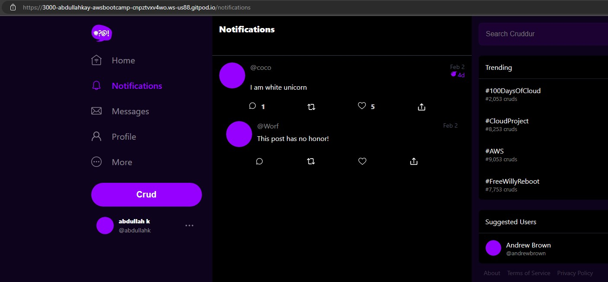

# Week 1 — App Containerization

[Click for Week1 Instruction](https://github.com/omenking/aws-bootcamp-cruddur-2023/blob/week-1/journal/week1.md)

- [Checklist](#todo-checklist)
- [Required work and Class Instructions](#required-work-and-class-instructions)
- [Homework Challenge](#homework-challenges)


## Todo Checklist
- [Watch How to Ask for Technical Help](https://www.youtube.com/watch?v=tDPqmwKMP7Y&list=PLBfufR7vyJJ7k25byhRXJldB5AiwgNnWv&index=29)
- [Watched Grading Homework Summaries](https://www.youtube.com/watch?v=FKAScachFgk&list=PLBfufR7vyJJ7k25byhRXJldB5AiwgNnWv&index=25)
- [Watched Week 1 - Live Streamed Video](https://www.youtube.com/watch?v=zJnNe5Nv4tE&list=PLBfufR7vyJJ7k25byhRXJldB5AiwgNnWv&index=22)
- [Remember to Commit Your Code](https://www.youtube.com/watch?v=b-idMgFFcpg&list=PLBfufR7vyJJ7k25byhRXJldB5AiwgNnWv&index=23)
- [Watcked Chirag's Week 1 - Spending Considerations](https://www.youtube.com/watch?v=OAMHu1NiYoI&list=PLBfufR7vyJJ7k25byhRXJldB5AiwgNnWv&index=24)
- [Watched Ashish's Week 1 - Container Security Considerations](https://www.youtube.com/watch?v=OjZz4D0B-cA&list=PLBfufR7vyJJ7k25byhRXJldB5AiwgNnWv&index=25)
- [Containerize Application (Dockerfiles, Docker Compose)](https://www.youtube.com/watch?v=zJnNe5Nv4tE&list=PLBfufR7vyJJ7k25byhRXJldB5AiwgNnWv&index=22)
- [Document the Notification Endpoint for the OpenAI Document](https://www.youtube.com/watch?v=k-_o0cCpksk&list=PLBfufR7vyJJ7k25byhRXJldB5AiwgNnWv&index=27)
- [Write a Flask Backend Endpoint for Notifications](https://www.youtube.com/watch?v=k-_o0cCpksk&list=PLBfufR7vyJJ7k25byhRXJldB5AiwgNnWv&index=27)
- [Write a React Page for Notifications](https://www.youtube.com/watch?v=k-_o0cCpksk&list=PLBfufR7vyJJ7k25byhRXJldB5AiwgNnWv&index=27)
- [Run DynamoDB Local Container and ensure it works](https://www.youtube.com/watch?v=CbQNMaa6zTg&list=PLBfufR7vyJJ7k25byhRXJldB5AiwgNnWv&index=28)
- [Run Postgres Container and ensure it works](https://www.youtube.com/watch?v=CbQNMaa6zTg&list=PLBfufR7vyJJ7k25byhRXJldB5AiwgNnWv&index=28)
***

## Required work and Class Instructions

### Containerize Backend
I fallowed all the instructions in the class [video](https://www.youtube.com/watch?v=zJnNe5Nv4tE) and I was able to create the Docker container. 

I have created the [Dockerfile](back-end-flask/../../backend-flask/Dockerfile) (name is important) under the back-end-flask directory. If you rename differently, it has to be added to build command with -f.

```dockerfile
FROM python:3.10-slim-buster
WORKDIR /backend-flask
COPY requirements.txt requirements.txt
RUN pip3 install -r requirements.txt

COPY . .

ENV FLASK_ENV=development

EXPOSE ${PORT}
CMD [ "python3", "-m" , "flask", "run", "--host=0.0.0.0", "--port=4567"]
````
Before I build the container I have tested the app.py code by manually installing the python and flask with the code below. Make sure being in the same directory.

```sh
pip3 install -r requirements.txt
python3 -m flask run --host=0.0.0.0 --port=4567

```
When we run the above code as a Dockerfile, it will check the requirement.txt (which is in the same directory) and install the flask and flask-cors.

### Build Container

To see the all initials for docker build enter
```sh
docker build --help
```
here are the most common ones:

```sh
-f, --file string  #Name of the Dockerfile (Default is 'PATH/Dockerfile')\
-t, --tag list    #Name and optionally a tag in the 'name:tag' format\
```

Then I ran the docker build command:
```sh
docker build -t  backend-flask ./backend-flask
```
After this image named backend-flask is created.

### Run a Container

Before we run the container, if we run one of the code below:
```sh
docker container run --help
docker run --help
```
Here are the most common ones:
```sh
--rm                             #Automatically remove the container when it exits
-p, --publish list               #Publish a container's port(s) to the host
-i, --interactive                #Keep STDIN open even if not attached
-t, --tty                        #Allocate a pseudo-TTY\
-e, --env list                   #Set environment variables\
-d, --detach                     #Run container in background and print container ID
```
This will run a container from the image we built earlier
```sh
docker run --rm -p 4567:4567 -it -e FRONTEND_URL='*' -e BACKEND_URL='*' backend-flask
```

!!!After I ran the container, make sure the ports are open, in gitpod.


### Get Container Images or Running Container Ids


```sh
gitpod /workspace/aws-bootcamp-cruddur-2023 (week1) $ docker image ls
REPOSITORY      TAG                IMAGE ID       CREATED          SIZE
backend-flask   latest             c8d3497f7aa9   43 minutes ago   129MB
python          3.10-slim-buster   b5d627f77479   13 days ago      118MB

gitpod /workspace/aws-bootcamp-cruddur-2023 (week1) $ docker container ls
CONTAINER ID   IMAGE           COMMAND                  CREATED          STATUS          PORTS                                       NAMES
8b41ac9b4fda   backend-flask   "python3 -m flask ru…"   27 seconds ago   Up 26 seconds   0.0.0.0:4567->4567/tcp, :::4567->4567/tcp   trusting_carver
gitpod /workspace/aws-bootcamp-cruddur-2023 (week1) $ 
```
### Gain Access to a Container
```sh
docker exec CONTAINER_ID -it /bin/bash
```
Or via the docker extension, right click and connect.

## Delete an Image / container
To delete a specific image type;
```sh
docker image ls
docker container ls
```
get the ID(first couple char+digits will be enough) or name of the image/container

```sh
docker image rm image_name
docker container rm container_name
#you may force with --force if needed
```
To delete all images:
```sh
docker image prune -a
docker container prune
#will prompt to confirm
```


## Containerize Frontend
### Run NPM Install
Run the code below before building the container since it needs to copy the contents of node_modules
```
cd frontend-react-js
npm i
```
I followed the same steps above and build the container and ran for frontend.

Switch to frontend-react-js, create a file here: frontend-react-js/Dockerfileand run the following dockerfile.

```dockerfile
FROM node:16.18

ENV PORT=3000

COPY . /frontend-react-js
WORKDIR /frontend-react-js
RUN npm install
EXPOSE ${PORT}
CMD ["npm", "start"]
```
build the image
```
docker build -t frontend-react-js ./frontend-react-js
```
run the container from the image
```
docker run -p 3000:3000 -d frontend-react-js
```
It worked.
3000
https://3000-abdullahkay-awsbootcamp-cnpztvxv4wo.ws-us87.gitpod.io

## Multiple Containers
we can create them both together with docker-compose. It will make it easy to put them up and down.

Create a docker-compose file
Create docker-compose.yml at the root of your project.

```yaml
version: "3.8"
services:
  backend-flask:
    environment:
      FRONTEND_URL: "https://3000-${GITPOD_WORKSPACE_ID}.${GITPOD_WORKSPACE_CLUSTER_HOST}"
      BACKEND_URL: "https://4567-${GITPOD_WORKSPACE_ID}.${GITPOD_WORKSPACE_CLUSTER_HOST}"
    build: ./backend-flask
    ports:
      - "4567:4567"
    volumes:
      - ./backend-flask:/backend-flask
  frontend-react-js:
    environment:
      REACT_APP_BACKEND_URL: "https://4567-${GITPOD_WORKSPACE_ID}.${GITPOD_WORKSPACE_CLUSTER_HOST}"
    build: ./frontend-react-js
    ports:
      - "3000:3000"
    volumes:
      - ./frontend-react-js:/frontend-react-js

# the name flag is a hack to change the default prepend folder
# name when outputting the image names
networks: 
  internal-network:
    driver: bridge
    name: cruddur

```
```sh
docker-compose up #to create all containers for both backend and frontend
#make sure the port are public/open.
docker-compose down #to remove all
```
## Create the notification feature (Backend and Front)

I followed the [video](https://youtu.be/k-_o0cCpksk?list=PLBfufR7vyJJ7k25byhRXJldB5AiwgNnWv) instructions and created the notification feature.
Here is the screenshot:



## Adding DynamoDB Local and Postgres
Since we are working on Gitpod, we need to install postgres. It will be helpful if we add the installtion commend in to [gitpod.yml](../.gitpod.yml) file to have it installed automatically.

```yml
- name: postgres
    init: |
      curl -fsSL https://www.postgresql.org/media/keys/ACCC4CF8.asc|sudo gpg --dearmor -o /etc/apt/trusted.gpg.d/postgresql.gpg
      echo "deb http://apt.postgresql.org/pub/repos/apt/ `lsb_release -cs`-pgdg main" |sudo tee  /etc/apt/sources.list.d/pgdg.list
      sudo apt update
      sudo apt install -y postgresql-client-13 libpq-dev
```
Before we build the containers we will build a dynamodb table with aws CLI:

### Create a table
[source](https://github.com/100DaysOfCloud/challenge-dynamodb-local/blob/main/README.md)
```sh
aws dynamodb create-table \
    --endpoint-url http://localhost:8000 \
    --table-name Music \
    --attribute-definitions \
        AttributeName=Artist,AttributeType=S \
        AttributeName=SongTitle,AttributeType=S \
    --key-schema AttributeName=Artist,KeyType=HASH AttributeName=SongTitle,KeyType=RANGE \
    --provisioned-throughput ReadCapacityUnits=1,WriteCapacityUnits=1 \
    --table-class STANDARD
```
### Create an Item
```sh
aws dynamodb put-item \
    --endpoint-url http://localhost:8000 \
    --table-name Music \
    --item \
        '{"Artist": {"S": "No One You Know"}, "SongTitle": {"S": "Call Me Today"}, "AlbumTitle": {"S": "Somewhat Famous"}}' \
    --return-consumed-capacity TOTAL  
```
### List Tables

```sh
aws dynamodb list-tables --endpoint-url http://localhost:8000
Get Records
aws dynamodb scan --table-name cruddur_cruds --query "Items" --endpoint-url http://localhost:8000
```
### Postgress service
```yml
services:
  db:
    image: postgres:13-alpine
    restart: always
    environment:
      - POSTGRES_USER=postgres
      - POSTGRES_PASSWORD=password
    ports:
      - '5432:5432'
    volumes: 
      - db:/var/lib/postgresql/data
volumes:
  db:
    driver: local
```
### Dynamodb service
```yml
services:
  dynamodb-local:
    # https://stackoverflow.com/questions/67533058/persist-local-dynamodb-data-in-volumes-lack-permission-unable-to-open-databa
    # We needed to add user:root to get this working.
    user: root
    command: "-jar DynamoDBLocal.jar -sharedDb -dbPath ./data"
    image: "amazon/dynamodb-local:latest"
    container_name: dynamodb-local
    ports:
      - "8000:8000"
    volumes:
      - "./docker/dynamodb:/home/dynamodblocal/data"
    working_dir: /home/dynamodblocal
```
I added both yml configurations to docker-compose file.
When we start docker-compose images will be built and containers will run.


***


## Homework Challenges    
- Run the dockerfile CMD as an external script
### Push and tag a image to DockerHub (they have a free tier)
All the commands:
```sh
docker image pull alpine #alpine image will be installed
docker image ls #It will show all installed/built images
docker image tag alpine:latest abdullahkayretli/aws-cloud-camp:latest #image will be retagged with dockerhub_name/repository_name
docker login #login cedentials will be checked
docker image push abdullahkayretli/aws-cloud-camp:latest #image will be pushed to the docke hub
```
[Click here to reach the repo](https://hub.docker.com/r/abdullahkayretli/aws-cloud-camp/tags)
  
  
- Use multi-stage building for a Dockerfile build
- Implement a healthcheck in the V3 Docker compose file
- Research best practices of Dockerfiles and attempt to implement it in your Dockerfile
- Learn how to install Docker on your localmachine and get the same containers running outside of Gitpod / Codespaces
- Launch an EC2 instance that has docker installed, and pull a container to demonstrate you can run your own docker processes. 


