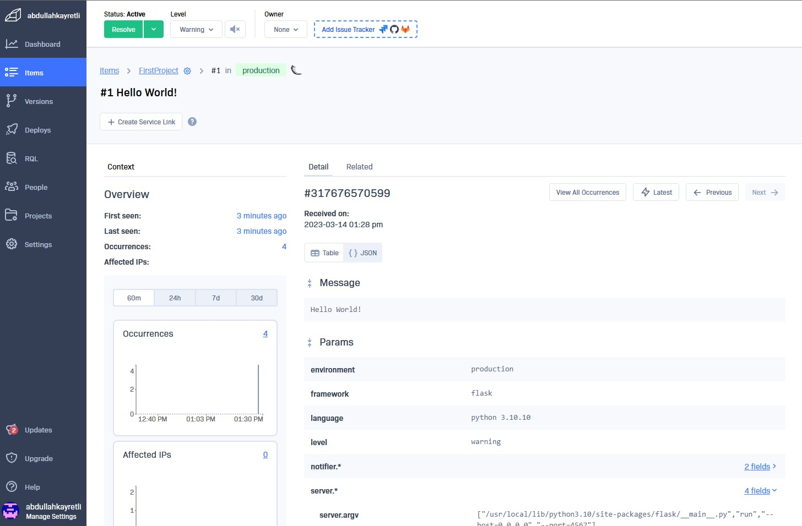

# Week 2 — Distributed Tracing
[**Week2 Instruction - Click here**](https://github.com/omenking/aws-bootcamp-cruddur-2023/blob/week-2/journal/week2.md)

- [Week 2 — Distributed Tracing](#week-2--distributed-tracing)
  - [Todo Checklist - Observability](#todo-checklist---observability)
  - [Homework Challenges](#homework-challenges)
    - [Instrument Honeycomb with OTEL](#instrument-honeycomb-with-otel)


## Todo Checklist - Observability

- [Watch Week 2 Live-Stream Video](https://youtu.be/2GD9xCzRId4?list=PLBfufR7vyJJ7k25byhRXJldB5AiwgNnWv)
- [Watch Chirag Week 2 - Spending Considerations (Coming Soon)]()
- [Watched Ashish's Week 2 - Observability Security Considerations](https://youtu.be/bOf4ITxAcXc?list=PLBfufR7vyJJ7k25byhRXJldB5AiwgNnWv)
- [Instrument Honeycomb with OTEL](https://youtu.be/2GD9xCzRId4?list=PLBfufR7vyJJ7k25byhRXJldB5AiwgNnWv)
- [Instrument AWS X-Ray](https://youtu.be/n2DTsuBrD_A?list=PLBfufR7vyJJ7k25byhRXJldB5AiwgNnWv)
- [Configure custom logger to send to CloudWatch Logs](https://youtu.be/ipdFizZjOF4?list=PLBfufR7vyJJ7k25byhRXJldB5AiwgNnWv)
- [Integrate Rollbar and capture and error](https://youtu.be/xMBDAb5SEU4?list=PLBfufR7vyJJ7k25byhRXJldB5AiwgNnWv)
  

## Homework Challenges 

- Instrument Honeycomb for the frontend-application to observe network latency between frontend and backend[HARD]
- Add custom instrumentation to Honeycomb to add more attributes eg. UserId, Add a custom span
- Run custom queries in Honeycomb and save them later eg. Latency by UserID, Recent Traces


***
## Instrument Honeycomb with OTEL

Click [here](https://docs.honeycomb.io/quickstart/#step-3-instrument-your-application-to-send-telemetry-data-to-honeycomb) to see the quickstart guide from HoneyComb documantation. We will follow the steps for python.
### Set the API Key and Service Name at gitpod
You'll need to grab the API key from your honeycomb account:

```
export HONEYCOMB_API_KEY="SZnpSHqgx20eNChoZHUjrF"
export HONEYCOMB_SERVICE_NAME="Cruddur"

gp env HONEYCOMB_API_KEY="SZnpSHqgx20eNChoZHUjrF"
gp env HONEYCOMB_SERVICE_NAME="Cruddur"
```
### Configuring OTEL (open telemetry) to send to HoneyComb
OpenTelemetry, also known as OTel for short, is a vendor-neutral open-source Observability framework for instrumenting, generating, collecting, and exporting telemetry data such as traces, metrics, logs. As an industry-standard it is natively supported by a number of vendors.

- Add the following Env Vars to backend-flask in docker compose
Added to the docker compose under environment. For more on OTEL click [here](https://opentelemetry.io/docs/)
```
OTEL_EXPORTER_OTLP_ENDPOINT: "https://api.honeycomb.io"
OTEL_EXPORTER_OTLP_HEADERS: "x-honeycomb-team=${HONEYCOMB_API_KEY}"
OTEL_SERVICE_NAME: "${HONEYCOMB_SERVICE_NAME}"
```

### Instrument Your Application to Send Telemetry Data to Honeycomb

- Install Packages
To install these we will add them to the requirement.txt file and during the docker compose it will be installed.
```sh
#requirement.txt
opentelemetry-api
opentelemetry-sdk
opentelemetry-exporter-otlp-proto-http
opentelemetry-instrumentation-flask
opentelemetry-instrumentation-requests

# to install all above run the command in the correct directory
pip install -r requirements.txt
pip install --upgrade pip
```
- Initialize 
Create a new file, tracing.py or add the following code to app,py. This will create and initialize a tracer and Flask instrumentation to send data to Honeycomb:

Copy
```sh
# tracing.py

from opentelemetry import trace
from opentelemetry.instrumentation.flask import FlaskInstrumentor
from opentelemetry.instrumentation.requests import RequestsInstrumentor
from opentelemetry.exporter.otlp.proto.http.trace_exporter import OTLPSpanExporter
from opentelemetry.sdk.trace import TracerProvider
from opentelemetry.sdk.trace.export import BatchSpanProcessor
from opentelemetry.sdk.trace.export import ConsoleSpanExporter, SimpleSpanProcessor


# Initialize tracing and an exporter that can send data to Honeycomb
provider = TracerProvider()
processor = BatchSpanProcessor(OTLPSpanExporter())
provider.add_span_processor(processor)

# Show this in the logs within the backend-flask app (STDOUT)
simple_processor = SimpleSpanProcessor(ConsoleSpanExporter())
provider.add_span_processor(simple_processor)

trace.set_tracer_provider(provider)
tracer = trace.get_tracer(__name__)

app = Flask(__name__)

# HoneyComb ---------
# Initialize automatic instrumentation with Flask
FlaskInstrumentor().instrument_app(app)
RequestsInstrumentor().instrument()
```
### Install Containers with Docker

- NPM install to the frontend
```
npm i
```

- docker-compose up

### See the trace in Honeycomb
- Refresh the backend
https://4567-abdullahkay-awsbootcamp-bpuzll0t21m.ws-us90.gitpod.io/api/activities/home


### Troubleshooting
-Make sure you are using the correct HoneyComb API key. To make sure you can check via:
http://honeycomb-whoami.glitch.me/


### Creating Spans 
[click for more](https://docs.honeycomb.io/getting-data-in/opentelemetry/python/)

```sh
tracer = trace.get_tracer("home.activities")

# Home-activities.py-under def run()
with tracer.start_as_current_span("mock-data"):

```


### Set Attribute on Span

```sh
# under with tracer.start...
span = trace.get_current_span() #newly added
now = datetime.now(timezone.utc).astimezone() # was in the code already
span.set_attribute("app.now", now.isoformat()) #newly added
```
- Max(app.result_length)

- Heatmap (duration_ms)-P90(duration_ms)


## X-Ray

[AWS SDK for Python - API references - X-Ray](https://boto3.amazonaws.com/v1/documentation/api/latest/reference/services/xray.html)
[AWS-Xray-SDK-Python github](https://github.com/aws/aws-xray-sdk-python)

Add to the requirements.txt
```sh
aws-xray-sdk
```
Install pythonpendencies
```sh
pip install -r requirements.txt
```
Add to app.py
```sh
from aws_xray_sdk.core import xray_recorder
from aws_xray_sdk.ext.flask.middleware import XRayMiddleware

xray_url = os.getenv("AWS_XRAY_URL")
xray_recorder.configure(service='backend-flask', dynamic_naming=xray_url)
XRayMiddleware(app, xray_recorder)
```

Setup AWS X-Ray Resources
Add aws/json/xray.json
```json
{
  "SamplingRule": {
      "RuleName": "Cruddur",
      "ResourceARN": "*",
      "Priority": 9000,
      "FixedRate": 0.1,
      "ReservoirSize": 5,
      "ServiceName": "Cruddur",
      "ServiceType": "*",
      "Host": "*",
      "HTTPMethod": "*",
      "URLPath": "*",
      "Version": 1
  }
}
```
Run the following command at AWS CLI to create an X-Ray group
```sh
aws xray create-group \
   --group-name "Cruddur" \
   --filter-expression "service(\"backend-flask\")"
```


Create sampling rule via CLI
```sh
aws xray create-sampling-rule --cli-input-json file://aws/json/xray.json
```


### Add AWS X-Ray Deamon Service to Docker Compose
```dockerfile
  xray-daemon:
    image: "amazon/aws-xray-daemon"
    environment:
      AWS_ACCESS_KEY_ID: "${AWS_ACCESS_KEY_ID}"
      AWS_SECRET_ACCESS_KEY: "${AWS_SECRET_ACCESS_KEY}"
      AWS_REGION: "us-east-1"
    command:
      - "xray -o -b xray-daemon:2000"
    ports:
      - 2000:2000/udp
```
We need to add these two env vars to our backend-flask in our docker-compose.yml file
```dockerfile
      AWS_XRAY_URL: "*4567-${GITPOD_WORKSPACE_ID}.${GITPOD_WORKSPACE_CLUSTER_HOST}*"
      AWS_XRAY_DAEMON_ADDRESS: "xray-daemon:2000"
```
Then run the docker file and check the logs of the containers.
Here is the screenshot from console.


***
### Start a custom segment/subsegment
Using context managers for implicit exceptions recording:
```sh
from aws_xray_sdk.core import xray_recorder

with xray_recorder.in_segment('segment_name') as segment:

# Add metadata or annotation here if necessary
segment.put_metadata('key', dict, 'namespace')
with xray_recorder.in_subsegment('subsegment_name') as subsegment:
    subsegment.put_annotation('key', 'value')
        # Do something here
with xray_recorder.in_subsegment('subsegment2') as subsegment:
        subsegment.put_annotation('key2', 'value2')
        # Do something else 
```


***

### CloudWatch Logs
Add to the requirements.txt\
More info on watchtower click [here](https://pypi.org/project/watchtower/).

```sh
#add watchtower to the requirement.txt
#then run
pip install -r requirements.txt
```

In app.py
```sh
import watchtower
import logging
from time import strftime


# Configuring Logger to Use CloudWatch
LOGGER = logging.getLogger(__name__)
LOGGER.setLevel(logging.DEBUG)
console_handler = logging.StreamHandler()
cw_handler = watchtower.CloudWatchLogHandler(log_group='cruddur')
LOGGER.addHandler(console_handler)
LOGGER.addHandler(cw_handler)
LOGGER.info('HomeActivities')
```
For error logging
```sh
@app.after_request
def after_request(response):
    timestamp = strftime('[%Y-%b-%d %H:%M]')
    LOGGER.error('%s %s %s %s %s %s', timestamp, request.remote_addr, request.method, request.scheme, request.full_path, response.status)
    return response
```
We'll log something in an API endpoint-Home_activities.py
```sh
LOGGER.info('Hello Cloudwatch! from  /api/activities/home')
```


Set the env var in your backend-flask for docker-compose.yml
```sh
      AWS_DEFAULT_REGION: "${AWS_DEFAULT_REGION}"
      AWS_ACCESS_KEY_ID: "${AWS_ACCESS_KEY_ID}"
      AWS_SECRET_ACCESS_KEY: "${AWS_SECRET_ACCESS_KEY}"
```


## Rollbar
https://rollbar.com/

Create a new project in Rollbar called Cruddur

Add to requirements.txt
```sh
blinker
rollbar
# install requirements
pip install -r requirements.txt
```

We need to set our access token. Grap it from rollbar.

```sh
export ROLLBAR_ACCESS_TOKEN="53ab857ae3664d75b79e34218d4*****"
gp env ROLLBAR_ACCESS_TOKEN="53ab857ae3664d75b79e34218d4*****"

#to test
env | grep ROLLBAR
```

Add to backend-flask for docker-compose.yml
```yaml
ROLLBAR_ACCESS_TOKEN: "${ROLLBAR_ACCESS_TOKEN}"
```
Import for Rollbar
```sh
import os
import rollbar
import rollbar.contrib.flask
from flask import got_request_exception

#to initialize
rollbar_access_token = os.getenv('ROLLBAR_ACCESS_TOKEN')
@app.before_first_request
def init_rollbar():
    """init rollbar module"""
    rollbar.init(
        #access token
        rollbar_access_token,
        #environment name
        'production',
        #server root directory, makes tracebacks prettier
        root=os.path.dirname(os.path.realpath(__file__)),
        #flask already sets up logging
        allow_logging_basic_config=False)

    #send exceptions from `app` to rollbar, using flask's signal system.
    got_request_exception.connect(rollbar.contrib.flask.report_exception, app)

#We'll add an endpoint just for testing rollbar
@app.route('/rollbar/test')
def rollbar_test():
    rollbar.report_message('Hello World!', 'warning')
    return "Hello World!"
```



